## こんな方におすすめ

- 小さなボタンが沢山あると混乱する方
- 大きなボタンで操作したい方
- 家族のスマホを見やすく設定してあげたい方

---

## 目次

- [基本の使い方](#基本の使い方)
  - [はじめに](#はじめに)
  - [ホーム画面](#ホーム画面)
  - [レイアウト編集モード](#レイアウト編集モード)
  - [ショートカットに設定できるもの](#ショートカットに設定できるもの)
  - [連絡先ショートカット](#連絡先ショートカット)
  - [外部ショートカット](#外部ショートカット)
  - [表示の切り替え](#表示の切り替え)
- [内蔵アプリ](#内蔵アプリ)
  - [カレンダー](#カレンダー)
  - [メモ帳](#メモ帳)
- [アプリ設定](#アプリ設定)
  - [ダークモード](#ダークモード)
  - [確認ダイアログ](#確認ダイアログ)
  - [ページの追加 (プレミアム)](#ページの追加プレミアム機能)
  - [バックアップ・復元 (プレミアム)](#バックアップ復元プレミアム機能)
- [ダウンロード](#ダウンロード)

---

## 基本の使い方

### はじめに

設定画面の一番上のボタンから、Androidのデフォルトホームアプリの設定画面を開けます。
シンプルカスタムランチャーをデフォルトホームアプリに指定してください。

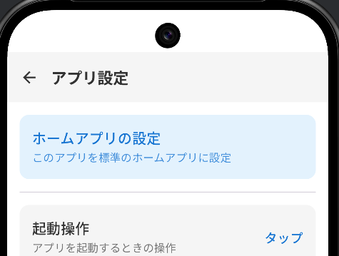

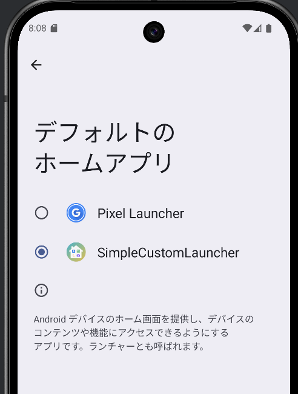

(設定画面にはホーム画面の左上のボタンから遷移できます)

### ホーム画面

初期状態では代表的なプリインストールアプリやアプリ内部機能が配置されています。

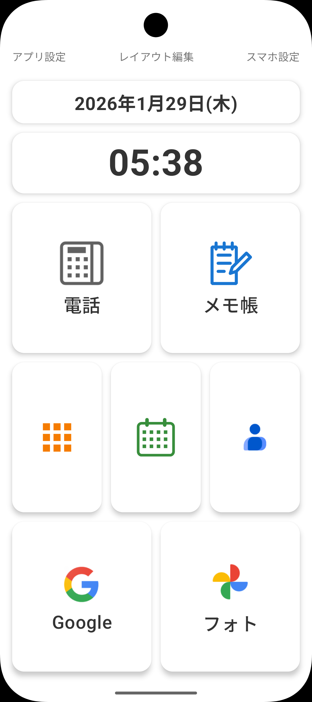

画面最上部の「アプリ設定」「レイアウト編集」「スマホ設定」は、設定にかかわらず常に表示されます。

- **アプリ設定**: このアプリの設定画面を開きます
- **スマホ設定**: 端末（スマホやタブレット）自体の設定画面を開きます
- **レイアウト編集**: レイアウト編集モードに移行します

### レイアウト編集モード

画面上部の「レイアウト編集」をタップすると編集モードに入ります。

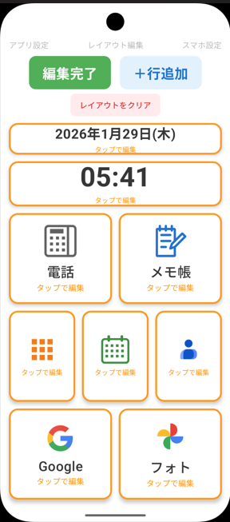

編集モードでは、アプリ配置用スロットが黄色い枠で囲われ、画面上部には
- 「編集完了」ボタン
- 「＋行追加」ボタン
- 「レイアウトをクリア」ボタン
- 「このページを削除」ボタン　（2ページ以上存在する時のみ表示）

が表示されます。

--- 

- **行追加**: 「＋行追加」ボタンでショートカットを置く行を追加します
- **分割数の変更**: 各行は横に1〜3分割できます。枠をタップして分割数を選択します
- **ショートカットの割り当て**: 空の枠をタップして、割り当てたいアプリや機能を選びます
- **スロットの色変更** (プレミアム機能): 各ショートカットの背景色と文字色を個別に変更できます。重要なショートカットを目立たせたり、カテゴリごとに色分けできます
- **ページ追加・削除**: 編集モードからページの追加や削除ができます
- **レイアウトのクリア**: 現在のページのレイアウトを一括でクリアできます

編集が完了したら「編集完了」をタップします。

### ショートカットに設定できるもの

| 種類 | 説明 |
|------|------|
| アプリ | インストール済みのアプリを割り当て |
| 電話発信 | 連絡先を指定してワンタップで電話 |
| SMS送信 | 連絡先を指定してワンタップでメッセージ |
| カレンダー | 内蔵カレンダーを開く |
| メモ帳 | 内蔵メモ帳を開く |
| アプリ一覧 | インストール済みアプリの一覧を表示（ホーム画面の上スワイプでも呼び出せます） |
| 日付表示 | 現在の日付をホーム画面に表示 |
| 時刻表示 | 現在の時刻をホーム画面に表示 |
| 外部ショートカット | LINEなど他アプリが提供するショートカットにも対応 |

### 連絡先ショートカット

特定の相手への電話発信・SMS送信をワンタップで行えるショートカットを配置できます。

**設定手順：**
1. レイアウト編集モードに入ります
2. 配置したいスロットをタップし、「連絡先から追加」を選びます

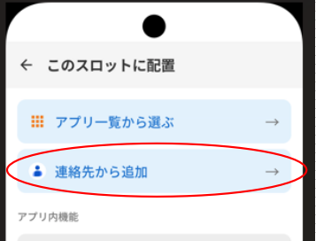

3. 連絡先の一覧から相手を選択します

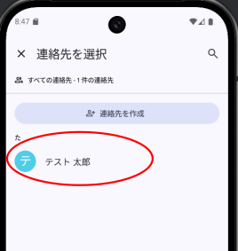

4. ダイアログで、電話かSMSかの選択を求められますので、希望する方を選択します。

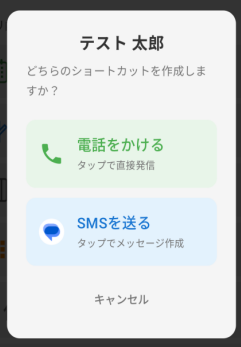

5. ショートカットが配置され、タップするだけで発信・送信画面が開きます

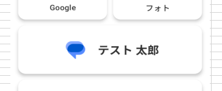

### 外部ショートカット

LINEなどのサードパーティ製アプリが提供するショートカットを配置できます。たとえばLINEの特定の相手とのトーク画面を開くショートカットなど、アプリ側が対応していればワンタップで呼び出せます。

**設定手順：**
1. **先に**シンプルカスタムランチャーをデフォルトのホームアプリに設定します
2. LINEなどのアプリ内で「ホーム画面にショートカットを追加」を実行します

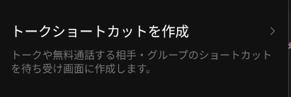

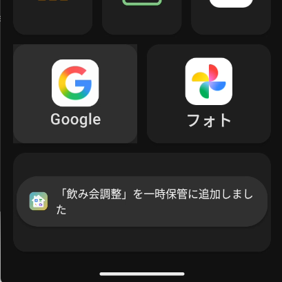

3. シンプルカスタムランチャーでレイアウト編集モードに入ります

4. 配置したいスロットをタップし、「一時保管」の中から追加したショートカットを選んで配置します

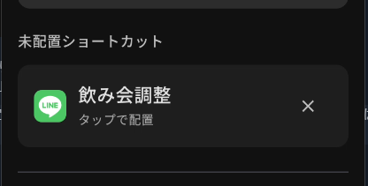

> **注意:** 必ずシンプルカスタムランチャーをホームアプリに設定してから、ショートカットを作成してください。設定前に作成されたショートカットは取り込むことができません。

### アプリ一覧の呼び出し

ホーム画面を下から上にスワイプすると、アプリ一覧画面を開けます。ショートカットとして配置していないアプリもここから起動できます。

### 表示の切り替え

各ショートカットは、アイコン付き表示と文字だけの表示を切り替えられます。文字だけの表示にすると、よりシンプルな見た目になります。

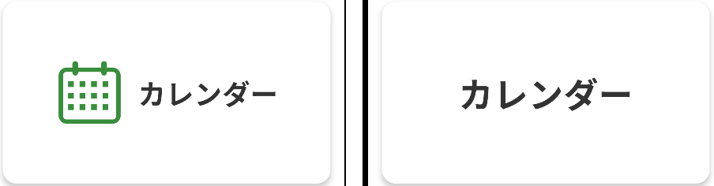

### スロット背景と文字色の変更（プレミアム機能）

プレミアム機能となりますが、スロットの背景と文字の色を変える事ができます。

---

## 内蔵機能

### カレンダー

祝日表示付きのシンプルなカレンダーです。
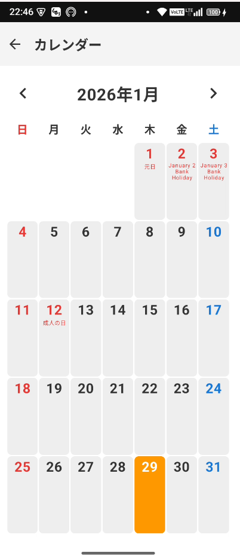

### メモ帳

大きな文字で簡単にメモを残せます。データは端末内のみに保存され、外部に送信されることはありません。
- チェックボックス付き
- 全選択・一括削除
- 1件あたり最大200文字、最大100件まで保存可能

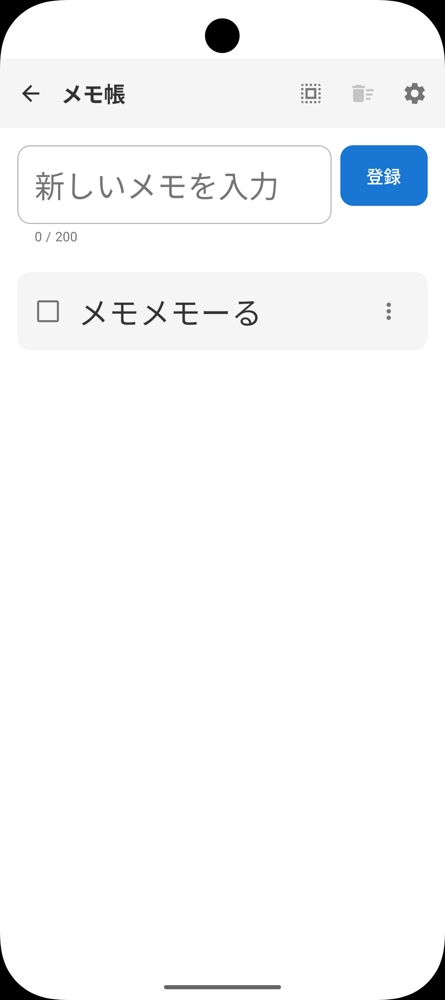
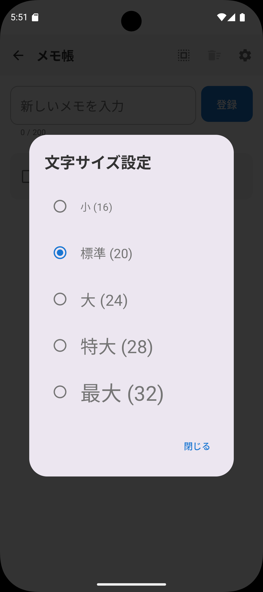

---

## アプリ設定

画面上部の「アプリ設定」から以下の設定を変更できます。

### ダークモード
ダークモード・ライトモード・スマホ設定に合わせる、を切り替えられます。

### 確認ダイアログ
ショートカットをタップした際に、起動前に確認ダイアログを表示できます。誤タップによる意図せぬアプリ起動を低減したい場合に有効にしてください。

### ページの追加　(プレミアム機能)
ホーム画面を最大5ページまで増やせます。ページはスワイプで切り替えできます。オプションでホーム画面のループスクロールするかどうかを切り替えられます。

### バックアップ・復元　(プレミアム機能)
ホーム画面のレイアウトやメモのデータをファイルに書き出し（エクスポート）、別の端末や初期化後に読み込み（インポート）できます。

---

### プレミアム機能

以下の機能はプレミアム機能です。動画広告の視聴（24時間限定）または課金（永久解除）でご利用いただけます。

| 機能 | 説明 |
|------|------|
| スロットの色変更 | ショートカットの背景色・文字色を個別に変更 |
| ページの追加 | ホーム画面を最大5ページまで追加 |
| バックアップ・復元 | レイアウトやメモのデータをエクスポート・インポート |

## ダウンロード

Google Play で配信中です。

---

## リンク

- [プライバシーポリシー](PRIVACY_POLICY)
